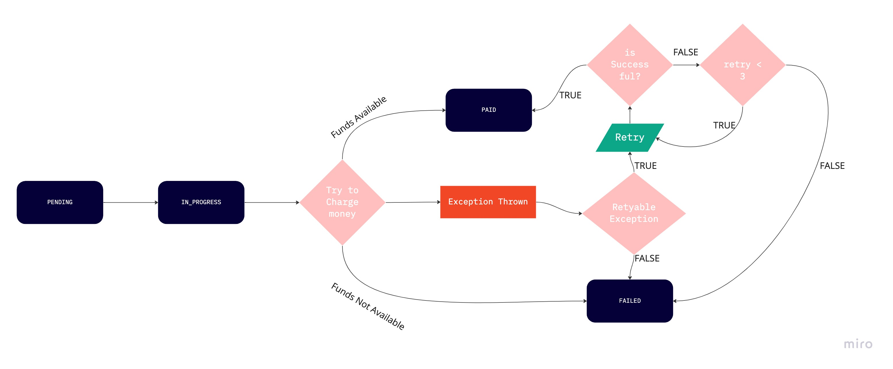

## Antaeus

Antaeus (/ænˈtiːəs/), in Greek mythology, a giant of Libya, the son of the sea god Poseidon and the Earth goddess Gaia. He compelled all strangers who were passing through the country to wrestle with him. Whenever Antaeus touched the Earth (his mother), his strength was renewed, so that even if thrown to the ground, he was invincible. Heracles, in combat with him, discovered the source of his strength and, lifting him up from Earth, crushed him to death.

Welcome to our challenge.

## The challenge

As most "Software as a Service" (SaaS) companies, Pleo needs to charge a subscription fee every month. Our database contains a few invoices for the different markets in which we operate. Your task is to build the logic that will schedule payment of those invoices on the first of the month. While this may seem simple, there is space for some decisions to be taken and you will be expected to justify them.

## Instructions

Fork this repo with your solution. Ideally, we'd like to see your progression through commits, and don't forget to update the README.md to explain your thought process.

Please let us know how long the challenge takes you. We're not looking for how speedy or lengthy you are. It's just really to give us a clearer idea of what you've produced in the time you decided to take. Feel free to go as big or as small as you want.

## Developing

Requirements:
- \>= Java 11 environment

Open the project using your favorite text editor. If you are using IntelliJ, you can open the `build.gradle.kts` file and it is gonna setup the project in the IDE for you.

### Building

```
./gradlew build
```

### Running

There are 2 options for running Anteus. You either need libsqlite3 or docker. Docker is easier but requires some docker knowledge. We do recommend docker though.

*Running Natively*

Native java with sqlite (requires libsqlite3):

If you use homebrew on MacOS `brew install sqlite`.

```
./gradlew run
```

*Running through docker*

Install docker for your platform

```
docker build -t antaeus .
docker run antaeus
```

### App Structure
The code given is structured as follows. Feel free however to modify the structure to fit your needs.
```
├── buildSrc
|  | gradle build scripts and project wide dependency declarations
|  └ src/main/kotlin/utils.kt 
|      Dependencies
|
├── pleo-antaeus-app
|       main() & initialization
|
├── pleo-antaeus-core
|       This is probably where you will introduce most of your new code.
|       Pay attention to the PaymentProvider and BillingService class.
|
├── pleo-antaeus-data
|       Module interfacing with the database. Contains the database 
|       models, mappings and access layer.
|
├── pleo-antaeus-models
|       Definition of the Internal and API models used throughout the
|       application.
|
└── pleo-antaeus-rest
        Entry point for HTTP REST API. This is where the routes are defined.
```

### Main Libraries and dependencies
* [Exposed](https://github.com/JetBrains/Exposed) - DSL for type-safe SQL
* [Javalin](https://javalin.io/) - Simple web framework (for REST)
* [kotlin-logging](https://github.com/MicroUtils/kotlin-logging) - Simple logging framework for Kotlin
* [JUnit 5](https://junit.org/junit5/) - Testing framework
* [Mockk](https://mockk.io/) - Mocking library
* [Sqlite3](https://sqlite.org/index.html) - Database storage engine

Happy hacking 😁!

### My Changes & Thoughts for the time I worked on this project!!!!

* Day 1 (06 October 2022) ~ 1 hrs excluding trying to understand kotlin
  * Tried to understand the project architecture.
  * Configure the service locally.
  * Small refactoring.
  * I'm new to kotlin so also looked into basic constructs of the language.
  * Thoughts:
    * The payment service should be altogether a separate service which consumes all the payment events being published on a topic but for the simplicity of 
      this challenge I am not going that route.
    * To make this scheduler perform well, it's really important that all the unpaid invoices for a particular month should be distributed between different 
      nodes in a cluster in batches.
    * Proper Error handling is required while calling the external payment provider.
    * Retry logic to handle network related issues.
    * Need to have a dead letter queue type of, a separate table in this case, which also contains the reason for the failure.

* Day 2 (08 October 2022) ~ 1.5 hrs
  * Started with thinking about how the dead letter queue should look like in case any failures occurs while charging the invoice.
  * Normally, it should be a messaging queue when we have a messaging framework driven architecture. Since, that's not the case I thought of introducing a 
    new InvoiceDLQ table which will contain all the Invoices' id's which failed on the first try and the reason for the failure.
  * I also introduced two new Invoice statuses namely, IN_PROGRESS & FAILED to make it very clear about the state of the invoice.
    * IN_PROGRESS -> 
      * means that some node has picked up the invoice and is working on trying to settle it. So, no other node picks it up.
      * It might be that while settling the invoice it resulted in some error, then the invoice will stay in this status until all the retries are 
        exhausted.
    * FAILED ->
      * Either all the retires are exhausted or the exception is having 0 retries.
      * Create an alert when an invoice goes to this state.
  * Also, worked on setting up the dal layer for the new table.
  
* Day 3 (10 Oct 2022) ~ 2 hrs
  * implemented the logic for handling PENDING Invoices.
    * Every node will pick up a chunk of PENDING requests exclusively using a distributed lock(which is yet to be implemented) from the DB and mark them as 
      IN_PROGRESS.
    * Based on the response from the payment provider or exception thrown, the status of the invoice will be updated to PAID or FAILED respectively.
    * Added a retry config using resilience4j.
    * If the invoice resulted in failure then an entry is also created in InvoiceDLQ with the exact reason for which the payment failed.
    * Added some methods in Dal to facilitate the business logic explained above.
        


* Day 4 (12 Oct 2022) ~ 1 hr
  * Added Test cases for Billing Service
  * Added InvoiceDLQ table to be created on startup

* Day 5 (13 Oct 2022) ~ 2 hr
  * Add redis to docker-compose
  * Introduce logic to acquire and release locks while fetching pending invoices.
  * In production the redis will be shared across all the antaeus nodes running in a cluster.

* Day 6(16 Oct 2022) Iteration 1 ~ 1 hr
  * Refactor Redis Lock implementation
  * Add test cases for RedisLock class
  * Introduce endpoint to initiate the settleInvoice

* Day 6(16 Oct 2022) Iteration 2~ .5 hr
  * Add Quartz Job Scheduler to schedule billing job
  * Update invoice get endpoint to add a status query param to fetch invoices based on status
  * 
* Pending tasks
  * Handle case where the node died after putting all the invoices to IN_PROGRESS
  * Send notification about the Failed invoices to the respective team so that it can be handled manually if possible
  * Implement handlers for failures
    
